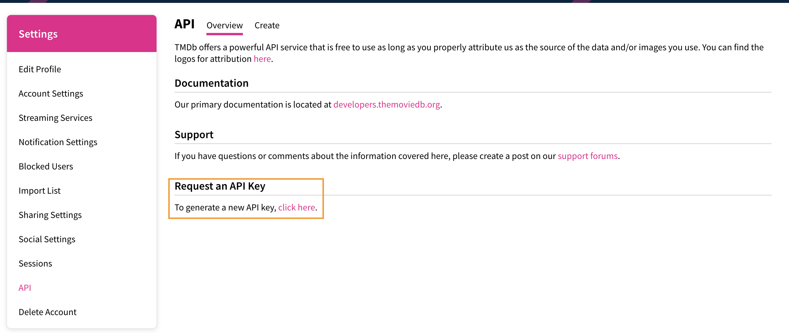
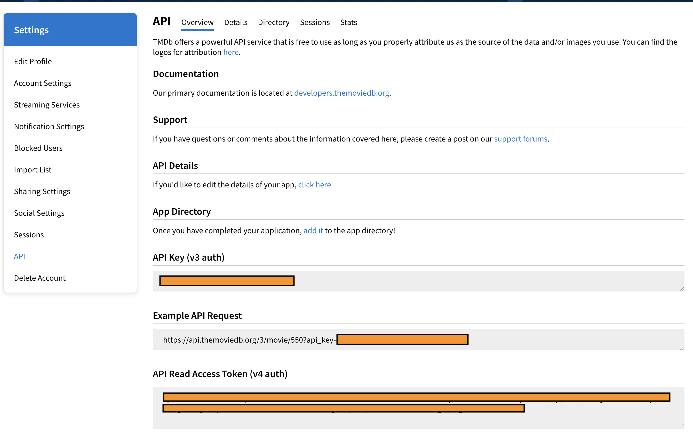

1. **Look at The Movie DB (TMDb) API**
1. Get to know the current state of the project
1. Model the response
1. Work with Swift API Client
1. Handle network errors
1. Create HTTP methods and routes
1. Configure the request
1. Implement Encoder
1. Handle the response
1. Make the call
1. Display the data 
1. Additional Starter Challenge
1. Preparing for Authentication
1. Updating Routes and Models for Authentication
1. Build out Authorization Flow
1. Final Touches

The Movie Database (TMDb) is a popular, user editable database for movies and TV shows. We'll be making it easier to discover the latest trending movies so that users are always up to date with the cinema. 

# Checkout TMDb

You will need to sign up for TMDb, register an application, and generate the token needed to use the API in our app.

When you get the chance, explore the Product Hunt for cool projects and ideas.

> [action]
> Go to [TMDb](https://www.themoviedb.org/) and create an account.
> 
> If you already have aTMDb account then navigate to the [API Dashboard](https://www.themoviedb.org/settings/api) from the drop-down menu under your account tab within `Settings`. 

With an account created you can now register an application, which will allow us to access the API. Follow the instructions under the `API` section with `Settings` to [request an API key](https://www.themoviedb.org/settings/api/request). We will also walk through theses steps together in the next step.

> [action]
> Read the [API docs](https://developers.themoviedb.org/3); this gives you all the information you need to use the API.

# Create An Application

In order to use the API, we'll have to register our application in the API Dashboard

From the API Docs page,

> [action]
> Click the account icon at top right and navigate to the `Settings`.
>
> Click on `API` on the left-hand pane to navigate to the API Dashboard
>
> 
>
> Under **Request an API Key** Click on the link to register for a _Developer_ API key and read through the terms and agreements. 
>
>
> Fill out the necessary details in the form and give your application a name and the following application URL:
> `com.{{YOUR_APPLE_ID}}.Moviefy`
>
> Click on _Submit_ to create the application 
>
>
> Your dashboard should now look similar to this:
> 

 Copy the value for the v4 key and keep it safely to the side somewhere, this is the one you'll use later in the project.